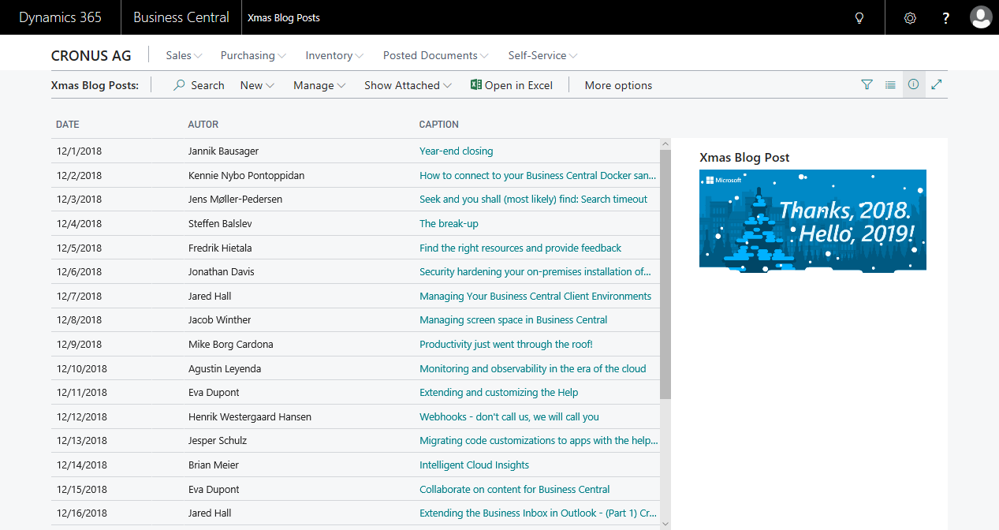
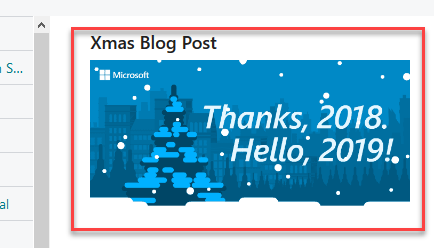

# Xmas Blog Posts

Why not to include the great blog posts from ["Counting down to the holidays with daily blogs"](https://community.dynamics.com/business/b/financials/archive/2018/12/19/counting-down-to-the-holidays-with-daily-blogs) into Microsoft Dynamics 365 Business Central? This was the question and in this repository you find an answer.

In my example I want to focus on usage of some of the new datatypes:

* List
* Dictionary

In CAL you you have imported the ***'BAD'*** .NET Framework to use these datatypes. In Microsoft AL they are included - and this is good!

## Disclaimer

This example is provided "AS IS". I want to show you my way to use these datatypes - and it may not be the best one. **Feel free to improve!**

## The App

It's just a list page with all the published blog posts and a small *JavaScript* Cotrol AddIn, to show the related image.


### How to store the Blog Posts

The simplest way is to add the URLs in code. I have choosen a codeunit which contains some of the new datatypes:

```js
var
    mPosts: List of [Date];
    mCaptions: Dictionary of [Date, Text];
    mURLs: Dictionary of [Date, Text];
    mAutors: Dictionary of [Date, Text];
    mImageUrls: Dictionary of [Date, Text];
```

Add some blog post information to the **dictionary** and **list**:

```js
// add new blog post information
local procedure AddBlogPost(date: Date; caption: Text; url: Text; autor: Text; imageUrl: Text)
begin
    // each date should be added once
    if not mPosts.Contains(date) then
        mPosts.Add(date);

    // remove the entry from dictionary, if it's already present
    // and store the value 'caption' with the key 'date'
    if mCaptions.ContainsKey(date) then
        mCaptions.Remove(date);
    mCaptions.Add(date, caption);

    // ...
end;

// the overloaded method (if there is no imageUrl)
local procedure AddBlogPost(date: Date; caption: Text; url: Text; autor: Text)
begin
    AddBlogPost(date, caption, url, autor, '');
end;
```

Copy all added Dates from `mPosts` to another list by using **foreach**. This allows to access the blog post information from outside:

```js
// Copy all Dates to another list
procedure GetBlogDates(var dates: List of [Date])
var
    d: Date;
begin
    foreach d in mPosts do
        dates.Add(d);
end;
```

Detailed blog post information like the `Caption` are provided in public methods:

```js
// Get the right value (caption) from dictionary for the key (date)
procedure GetCaption(date: Date): Text
begin
    if mCaptions.ContainsKey(date) then
        exit(mCaptions.Get(date));
end;
```

### A List Page without a Table

To show a list in a page, we need a record. Well you can create a new table, but I won't do this in my example. I reused the first table I found and took `"Date Lookup Buffer"` as a `Temporary Table` for my page:

```js
// Let's cheat a little bit and reuse an existing table
SourceTable = "Date Lookup Buffer";
SourceTableTemporary = true;
```

### Control AddIn ... My additional Xmas Part

The Microsoft images are cool and I want to see the image of the related blog post in the factboxes of my page - like this:



If you want to go deeper to this chapter of **Control AddIns or JavaScript** - I strongly recommend to book a workshop by [**Vjekoslav Babić** @ http://vjeko.com/](http://vjeko.com/) or read his blog posts!

I have learned a **Control AddIn** need to be wraped in a **CardPard**.

```js
page 50101 "MME Xmas Control Factbox"
{
    PageType = CardPart;
    Caption = 'Xmas Blog Post';

    layout
    {
        area(Content)
        {
            usercontrol(XmasTree; "MME Xmas Control")
            {
                ApplicationArea = All;
                // ...
            }
        }
    }
}
```

Later this **CardPard** can be added to `area(Factboxes)` of my page:

```js
area(Factboxes)
{

    part("MME Xmas Control PagePart"; "MME Xmas Control Factbox")
    {
        ApplicationArea = All;
    }
}
```

The control itself uses the URLs and produce HTML code for the control AddIn.

```js
controlAddIn.innerHTML = '<div><a href="' + url + '" target="_blank">'
        + '</ image>'
        + '</a></div>';
```